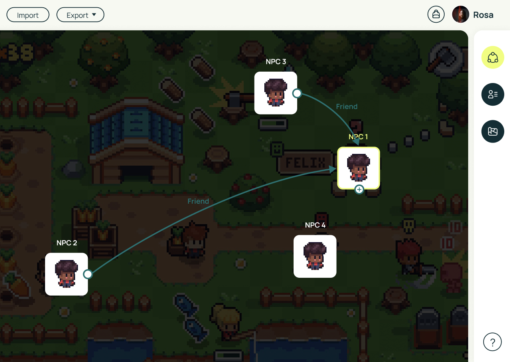
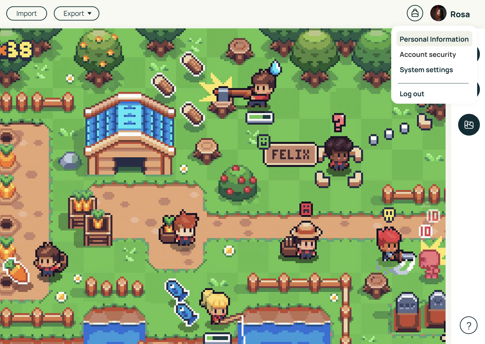
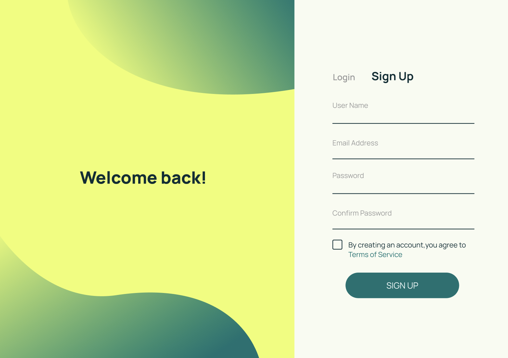

## 🔭 My Current Building

> This is a collaborative & private repository developed during my internship. Demo and code are available upon request.

### About the Project

I’m currently contributing to the development of *Caerulean-AI*, an enterprise-grade NPC simulation platform. This collaborative project bridges **AI agents** with **game design**, exploring ways to build NPC agents for games: natural dialogue, emotional reactions, and personalized visual traits like avatars and behaviors. 

Inspired by Stanford’s *Generative Agents*, *Caerulean-AI* seeks to build an **NPC solution** that creates richer, more interactive, and immersive NPC experiences for future game worlds.

- **Data layer**: *Caerulean-ai* combines PostgreSQL (as the primary relational database), pgvector for vector similarity search, and Neo4j to support AI agent interactions and **social graph** modeling. MinIO serves as an object-storage layer for generated images.

- **Backend**: The system integrates local **LLM** inference (**Ollama** + **LangChain**) and image generation (**Stable Diffusion** + **ControlNet**) to power NPC behavior, dialogue, and avatar generation.

- **Frontend**: The game frontend uses React + TypeScript + Phaser (game engine), with a full NPC interaction system running inside a Vite-powered UI.

- **Architecture**: The platform follows Domain-Driven Design (DDD) principles and adopts **Inversion of Control** (IoC) and **Dependency Injection** (DI) patterns for extensibility and modularity.

- **Deployment**: The system is automatically deployed with **Kubernetes** + **ArgoCD**, with GitHub Actions handling CI/CD pipelines and GHCR for Docker image publishing.

### Contribution Highlights

During my internship, I contributed to:

- 🛠️ Architecting and deploying K3s-based Kubernetes infrastructure with ArgoCD GitOps workflows for automated multi-environment deployments (dev → prod).
- ⚙️ Building CI/CD pipelines with GitHub Actions for both frontend and backend services, automating testing, Docker image builds, and publishing to GHCR with tag-triggered releases, reducing release time from hours to 20 minutes.
- 🔐 Fixing cross-layer authentication validation bugs by standardizing password rules across React frontend and Node.js backend.
- 💬 Enhancing error feedback UX by mapping backend API error codes to clear frontend messages, improving signup/login experience.

### Technologies: 
TypeScript, Node.js, Neo4j, Vite, Python, pgvector, Prisma, Stable Diffusion, Ollama, GitHub Actions, Kubernetes (K3s), ArgoCD, Docker, MinIO
